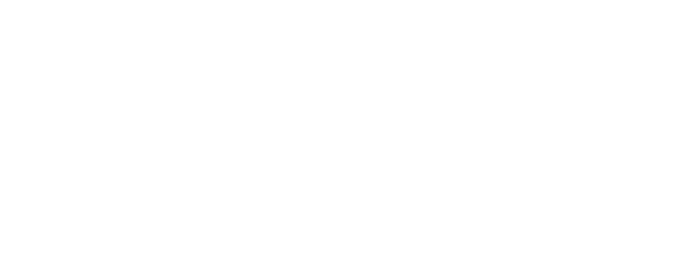

<!--
Hey, thanks for using the awesome-readme-template template.
If you have any enhancements, then fork this project and create a pull request
or just open an issue with the label "enhancement".

Don't forget to give this project a star for additional support ;)
Maybe you can mention me or this repo in the acknowledgements too
-->

<!--
This README is a slimmed down version of the original one.
Removed sections:
- Screenshots
- Running Test
- Deployment
- FAQ
- Acknowledgements
-->

  
  <h1>Nebula Client</h1>
  
  

    An awesome client for the best experience! 
  

<!-- Badges -->

  
  
  
  
  
  

   
<h4>
    <a href="https://youtube.com/">View Demo</a>
   · 
    <a href="https://github.com/NebulaBuilds/NebulaClient/issues/">Report Bug</a>
   · 
    <a href="https://github.com/NebulaBuilds/NebulaClient/issues/">Request Feature</a>
  </h4>

 

<!-- Table of Contents -->

# Table of Contents

- [About the Project](#about-the-project)
  - [The Idea](#the-idea)
  - [A long time ago](#a-long-time-ago)
  - [The great team](#the-great-team)
  - [Always supporting](#always-supporting)
- [How to install](#how-to-install)
  - [Prerequisites](#prerequisites)
  - [Installation](#installation)
  - [Run](#run)
- [Roadmap](#roadmap)
- [Contact](#contact)
- [Acknowledgements](#acknowledgements)

<!-- About the Project -->

## About the Project

 
  

<!-- The Idea -->

### The Idea

We always wanted to improve the experience of minecraft in any possible way. And that why we founded NebulaWorks, the organisation that owns the NebulaClient!

<!-- A long time ago -->

### A long time ago

Nebual didn't just randomly appear. Maybe you already know us under a other name. "EruxMod", was our first try making a minecraft mod which was very popular in our community but the client wasn't quiet ready for the hype. Thats why it died and the developement stopped.

<!-- The great team -->

### The great team

But something is still there from the old EruxMod which is the great team. Which always helped us to improve the client. They also didn't run away when the developement of EruxMod stoped.

<!-- Always supporting -->

### Always supporting

But the most importent people are you! Because the users have always asked us about an update and we tried our best till the end. We hope that this will still continue with the new Nebula Version

## How to install

<!-- Prerequisites -->

### Prerequisites

The current version of the launcher is not compatible with any other os then **windows**. Please join the [Discord](https://discord.gg/5jDNF78MgY) for any other informations

<!-- Installation -->

### Installation

1. Download the latest release of the launcher
2. Run the installer

<!-- Run Locally -->

### Run

In the launcher you can select the different versions you want to run. The you just have to click on `Launch` and you will need to put your microsoft account credentionals into the login screen.

1. Open Launcher
2. Select Version
3. Launch Game

<!-- Roadmap -->

## Roadmap

- [x] Custome Launcher
- [x] Different versions
- [ ] Cosmetics
<!-- Contact -->

## Contact

Project Link: [https://github.com/NebulaBuilds/NebulaClient](https://github.com/NebulaBuilds/NebulaClient)

<!-- Acknowledgments -->

## Acknowledgements

Here are the most important librarys used in our client.

- [Node.Js](https://nodejs.org/)
